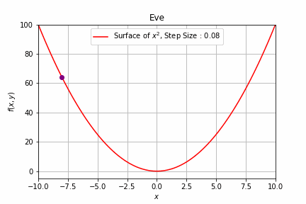
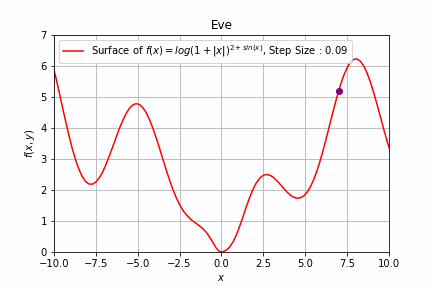
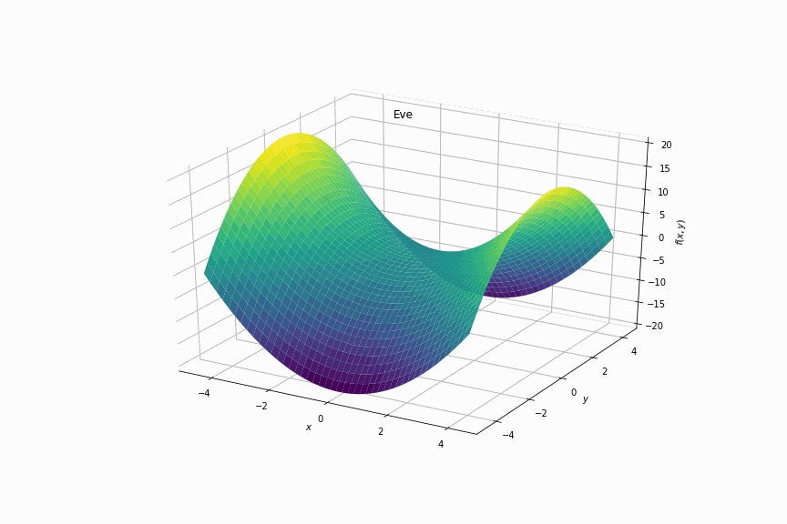

# EVE: The EVer Evolving Deep Learning Optimizer


EVE is a new optimizer library built on top of PyTorch that combines the best of multiple state-of-the-art optimizer algorithms into one flexible, infinitely customizable super-optimizer.

The goal of EVE is not to provide one final, static optimizer, but rather an interface to a PyTorch optimizer that will continue to implement the latest, well-tested methods from modern research.

In preliminary testing, the current implementation of EVE was able to beat Adam and other near state-of-the-art optimizers without a significant increase in compute time. Here are some inital results from training a ResNet18 on the ImageNette (subset of ImageNet that encompasses a few hard to classify classes) 5 epoch challenge.

### Adam (Final Accuracy = 40.00%)

|epoch |	train_loss |	valid_loss |	accuracy |	time|
|------|------------|------------|----------|-----|
|0 |	2.479557 |	9.522848 |	0.129936 |	00:33|
|1 |	2.223202 |	2.041943 |	0.433121 |	00:33|
|2 |	2.529300 |	2.300190 |	0.212994 |	00:34|
|3 |	2.018234 |	1.866597 |	0.347261 |	00:35|
|4 |	1.780924 |	1.732265 |	**0.400000** |	00:35|

### EVE (Final Accuracy = 70.62%)

|epoch |	train_loss |	valid_loss |	accuracy |	time|
|------|------------|------------|----------|-----|
|0 |	2.396812 |	2.617368 |	0.335287 |	00:39
|1 |	2.170482 |	1.626544 |	0.478726 |	00:39
|2 |	1.526003 |	1.672156 |	0.501146 |	00:39
|3 |	0.956125 |	0.949652 |	0.696306 |	00:39
|4 |	0.567583 |	0.949395 |	**0.706242** |	00:39
 
 Here are a few animations demonstrating EVE's convergence properties on simple functions:

 2D Convex Surface             |  2D Non-Convex Surface          | 3D Surface with Saddle Point 
:-------------------------:|:-------------------------:|:-------------------------:
  |   | 

## Installation and Getting Started

The simplest way to use EVE in your PyTorch models is to install it using pip:

```
pip install eve-optimizer
```

Then, the main EVE optimizer can be imported as follows:

```
from eve.optimizers import eveo3
```

This will import a function that returns a `torch.optim.Optimizer` object, which can be used in the usual way.

The EVE library also provides a direct interface to other optimizers (like Ranger, RAdam, etc.) that were used in part or were built upon to create the main EVE optimizer. These can also be accessed from `eve.optimizers` in the same way.

## What Exactly is EVE?
At present, EVE implements (and combines) the following algorithms:
- [Adam](https://arxiv.org/abs/1412.6980)
- [RAdam](https://arxiv.org/abs/1908.03265v1)
- [LARS](https://arxiv.org/abs/1708.03888)
- [LAMB](https://arxiv.org/abs/1904.00962)
- [LookAhead](https://arxiv.org/abs/1907.08610)
- [DiffGrad](https://arxiv.org/abs/1909.11015)

We are currently working on adding in the following variants as well:
- [AdaMod](https://arxiv.org/abs/1910.12249)
- [DeepMemory](https://github.com/lessw2020/Best-Deep-Learning-Optimizers/tree/master/DeepMemory)
- Marina
